Backend-leaning software engineer who reasons from first principles and ships things that talk to real infrastructure, not just demos.

**Currently:** building [Sentinel](https://github.com/rishibhansali/sentinel-fraud-detection), a real-time fraud detection platform, and interning as a Software Engineer at **Ramedia Technologies** — backend, REST APIs, PostgreSQL, AI-assisted workflows.

 

### Stack

**Languages**

**Frontend & Backend**

**AI & ML**

**Infra**

 

### Featured Projects

**[Sentinel](https://github.com/rishibhansali/sentinel-fraud-detection)** — real-time fraud detection platform: deterministic scoring engine, a PostgreSQL optimization benchmark, and a WebSocket case-review queue. *(in progress)*

**[Page Pilot](https://github.com/rishibhansali/page-pilot)** — Chrome extension that reads a webpage and takes the actions you describe in plain English, powered by Claude.

 

### Contact

[LinkedIn](https://www.linkedin.com/in/rishi-bhansali-80360721a) · rishi.jaguars@gmail.com
